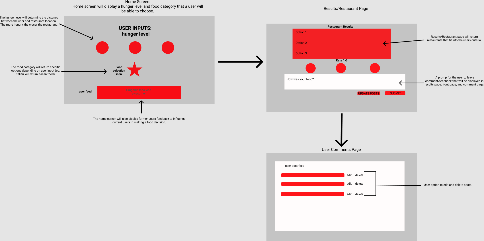
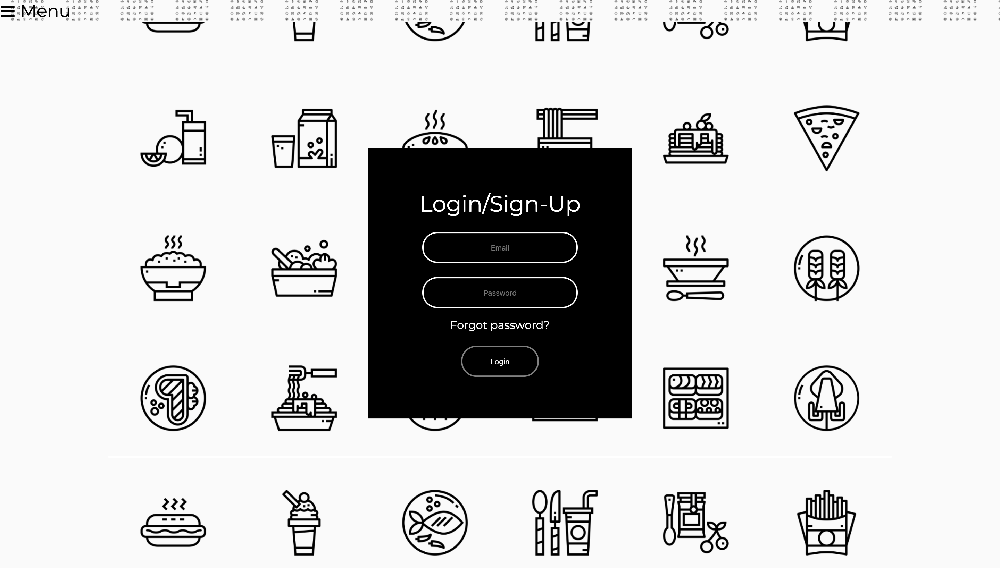
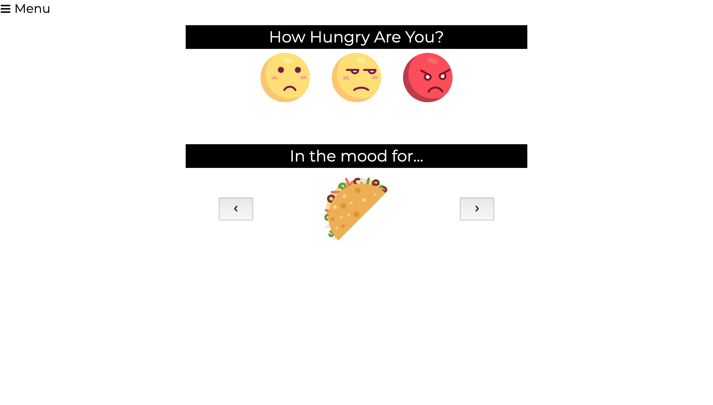
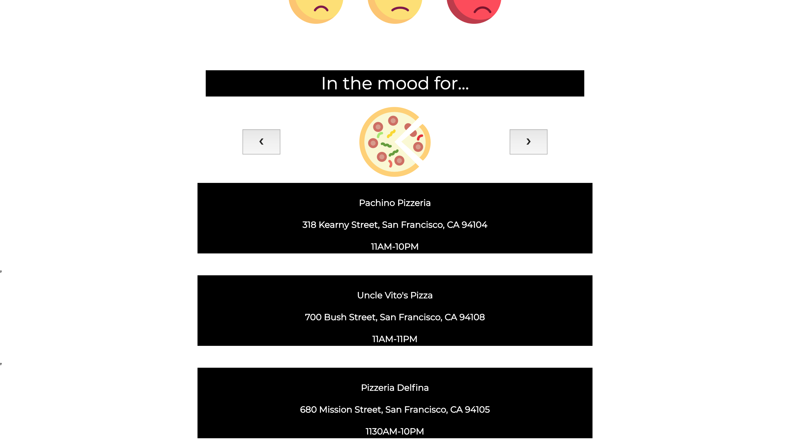
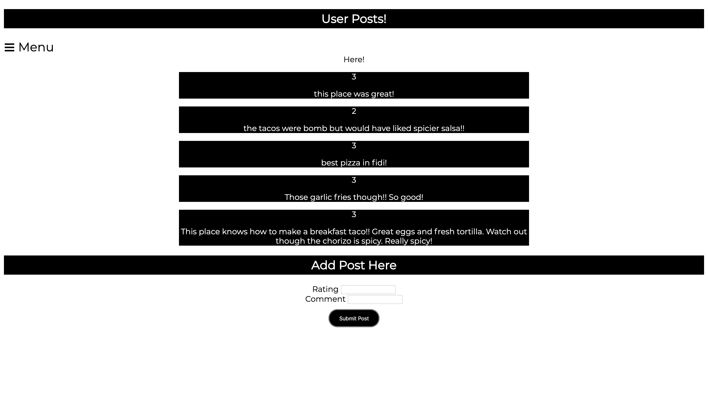

<h1>Project 1</h1>
<h2>Hangry!</h2>

<h3>Description</h3>
Hangry? Can't wait? Hangry helps you decide where to eat depending on your budget, location, and how bad you're starving.

User is someone who's been working hard all day, they get out of work and super hungry. The last thing they want to do is decide what to eat. Hangry helps them navigate that process by narrowing down the search. 

<h3>Tools used</h3>
HTML, CSS, JS, Mongoose, Node, Bootstrap, MongoDB

<h3>Wireframe</h3>

wireframe consisted of homepage in which user would decide parameters to narrow down results. We also wanted to include a user-comment feed in the begining stages of selection process to influence the user. The results would consist of a top 3 restuarants near the user. We also included a third page where users can go into to reach their comments to update or delete them. 

<h3>Stretch Goals</h3>
<ul>
  <li>Add budget parameter.</li>
  <li>Fix hunger meter.</li>
  <li>Add external API to increase results.</li>
  <li>Log in authorization.</li>
  <li>Add dietary restrictions.</li>
</ul>
